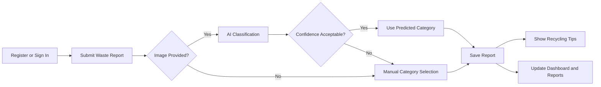
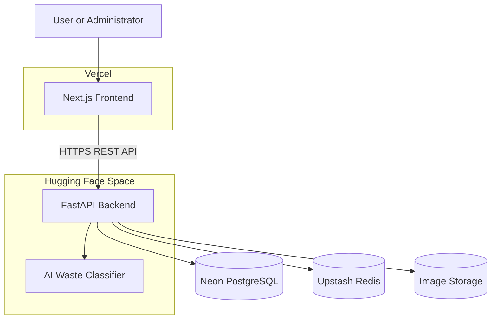
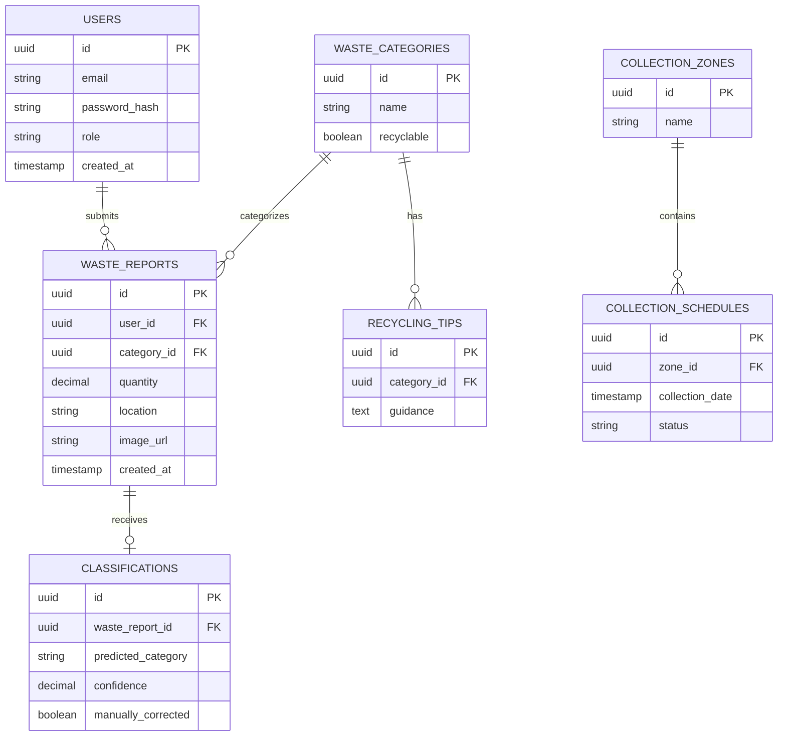
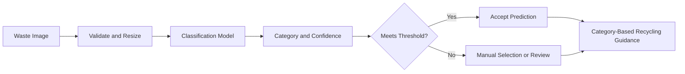

# EnviRescue

**AI-Powered Smart Waste Management System**

EnviRescue is a proposed full-stack application that promotes environmentally responsible waste disposal. It allows users to record waste, classify waste from an image with AI assistance, receive recycling guidance, check collection schedules, and monitor their waste activity.

---

## Project Objective

The objective is to develop an intelligent waste-management system that:

- tracks users' waste generation;
- classifies common waste categories using AI;
- provides appropriate recycling or disposal recommendations;
- communicates collection schedules;
- presents useful waste and recycling statistics; and
- demonstrates practical green software engineering.

---

## Core Requirements

The initial release is limited to the eight modules requested in the project brief.

| # | Module | Minimum acceptance criteria |
|---|---|---|
| 1 | User Registration | A user can create an account, sign in, sign out, and access their own records. |
| 2 | Waste Reporting | An authenticated user can submit the waste type, quantity, location, description, and an optional image. |
| 3 | Waste Classification | A submitted image can be classified into a supported waste category with a confidence score. A low-confidence result can be corrected manually. |
| 4 | Recycling Tips | The system shows recycling or safe-disposal guidance for the selected or predicted category. |
| 5 | Collection Schedule | A user can view upcoming collection dates for an available location or zone. |
| 6 | Dashboard | A user can see total waste, waste by category, recycling activity, and recent submissions. |
| 7 | Reports | A user can view a summary of waste activity over a selected date range. An administrator can view an overall summary. |
| 8 | Administrator Module | An administrator can manage users, categories, recycling tips, collection schedules, and review waste classifications. |

### Initial Waste Categories

- Plastic
- Paper
- Glass
- Metal
- Organic
- Electronic waste
- Hazardous waste
- General or mixed waste

Administrators may maintain these categories without changing application code.

---

## Core User Flow



The AI supports the user rather than making an irreversible decision. Users or administrators can correct uncertain classifications.

---

## Architecture



The Next.js frontend communicates with the FastAPI backend over HTTPS. The backend owns authentication, validation, application rules, AI inference, and access to external data services. The image-storage provider will be selected during implementation; PostgreSQL stores image references rather than image binary data.

### Technology Stack

| Layer | Technology |
|---|---|
| Frontend | Next.js, React, TypeScript, Tailwind CSS |
| Backend | Python, FastAPI, Pydantic, SQLAlchemy, Alembic |
| AI | Python and a Hugging Face-compatible image-classification model |
| Database | PostgreSQL hosted on Neon |
| Cache | Redis hosted on Upstash |
| Frontend hosting | Vercel |
| Backend and AI hosting | Hugging Face Spaces |
| Tooling | pnpm, Docker, Git, GitHub Actions |

---

## Planned Repository Structure

```text
envirescue/
|-- apps/
|   |-- web/                         # Next.js frontend
|   |   |-- app/
|   |   |   |-- (auth)/              # Public authentication pages
|   |   |   |   |-- login/
|   |   |   |   `-- register/
|   |   |   |-- (dashboard)/         # Authenticated user pages
|   |   |   |   |-- dashboard/
|   |   |   |   |-- waste/
|   |   |   |   |   |-- new/         # Waste-report form
|   |   |   |   |   `-- [id]/        # Waste-report details
|   |   |   |   |-- classify/        # Image classification
|   |   |   |   |-- recycling/       # Category-based guidance
|   |   |   |   |-- collections/     # Collection schedules
|   |   |   |   |-- reports/         # Date-range summaries
|   |   |   |   `-- settings/        # User profile settings
|   |   |   |-- admin/               # Administrator-only pages
|   |   |   |   |-- dashboard/
|   |   |   |   |-- users/
|   |   |   |   |-- categories/
|   |   |   |   |-- recycling-tips/
|   |   |   |   |-- collections/
|   |   |   |   `-- classifications/
|   |   |   |-- layout.tsx           # Root application layout
|   |   |   |-- page.tsx             # Public landing page
|   |   |   `-- globals.css
|   |   |-- components/
|   |   |   |-- ui/                   # Reusable interface primitives
|   |   |   |-- forms/                # Auth and waste-report forms
|   |   |   |-- dashboard/            # Statistics and summary cards
|   |   |   |-- charts/               # Waste data visualizations
|   |   |   `-- layout/               # Navigation and page shells
|   |   |-- hooks/                    # Reusable React hooks
|   |   |-- lib/
|   |   |   |-- api.ts                # Typed FastAPI client
|   |   |   |-- auth.ts               # Client authentication helpers
|   |   |   |-- constants.ts
|   |   |   `-- utils.ts
|   |   |-- public/                   # Static frontend assets
|   |   |-- types/                    # Frontend-specific TypeScript types
|   |   |-- middleware.ts             # Route and role protection
|   |   |-- next.config.ts
|   |   |-- package.json
|   |   `-- tsconfig.json
|   |
|   `-- api/                           # FastAPI backend and AI integration
|       |-- app/
|       |   |-- main.py                # Application entry point
|       |   |-- api/
|       |   |   |-- dependencies.py    # Shared request dependencies
|       |   |   `-- routes/
|       |   |       |-- auth.py
|       |   |       |-- users.py
|       |   |       |-- waste.py
|       |   |       |-- classifications.py
|       |   |       |-- categories.py
|       |   |       |-- recycling.py
|       |   |       |-- collections.py
|       |   |       |-- dashboard.py
|       |   |       |-- reports.py
|       |   |       `-- admin.py
|       |   |-- core/
|       |   |   |-- config.py          # Environment-based settings
|       |   |   |-- database.py        # PostgreSQL connection and sessions
|       |   |   |-- cache.py           # Upstash Redis client
|       |   |   `-- security.py        # Password and token utilities
|       |   |-- models/                # SQLAlchemy database models
|       |   |   |-- user.py
|       |   |   |-- category.py
|       |   |   |-- waste_report.py
|       |   |   |-- classification.py
|       |   |   |-- recycling_tip.py
|       |   |   `-- collection.py
|       |   |-- schemas/               # Pydantic request/response schemas
|       |   |   |-- auth.py
|       |   |   |-- user.py
|       |   |   |-- waste.py
|       |   |   |-- classification.py
|       |   |   |-- recycling.py
|       |   |   |-- collection.py
|       |   |   `-- report.py
|       |   |-- services/              # Application business rules
|       |   |   |-- auth_service.py
|       |   |   |-- waste_service.py
|       |   |   |-- classification_service.py
|       |   |   |-- recycling_service.py
|       |   |   |-- collection_service.py
|       |   |   `-- report_service.py
|       |   |-- ai/
|       |   |   |-- classifier.py      # Model loading and inference
|       |   |   |-- preprocessing.py   # Image validation and resizing
|       |   |   `-- confidence.py      # Threshold and review handling
|       |   |-- storage/
|       |   |   `-- images.py          # External image-storage adapter
|       |   `-- utils/
|       |       |-- pagination.py
|       |       `-- image_hash.py      # Classification-cache key helper
|       |-- alembic/                   # Database migration versions
|       |-- tests/
|       |   |-- unit/
|       |   `-- integration/
|       |-- Dockerfile                 # Hugging Face Space container
|       |-- requirements.txt
|       |-- alembic.ini
|       `-- README.md
|
|-- packages/                           # Optional shared workspace packages
|   |-- ui/                             # Shared React components
|   |-- types/                          # Shared API contracts
|   `-- config/                         # Shared lint and TypeScript config
|-- docs/
|   |-- ai/                             # Dataset and model evaluation
|   |-- api/                            # Additional API examples
|   `-- assessment/                     # Screenshots and green evidence
|-- .github/
|   `-- workflows/                      # Test and deployment automation
|-- .env.example                        # Safe environment variable template
|-- .gitignore
|-- package.json                        # Root workspace scripts
|-- pnpm-workspace.yaml
|-- turbo.json
|-- LICENSE
`-- README.md
```

This is the intended structure and will evolve only where implementation requires it. The frontend is organized by user-facing routes, while the backend separates HTTP routes, validation schemas, database models, business services, and AI logic. This separation keeps the eight required modules traceable without forcing every small feature into its own package.

The `packages/` directory is optional. Shared packages should only be introduced when code is genuinely reused across workspaces; otherwise, types and components should remain inside the application that owns them.

---

## Data Model

The minimum data model supports authentication, waste records, classifications, recommendations, schedules, and reports derived from stored records.



Dashboard values and reports are calculated from waste records; separate report tables are unnecessary for the initial release unless generated files must be retained.

---

## AI Waste Classification

The classifier accepts a waste image and returns a supported category and confidence score.



Recycling guidance is category-based and does not need to be generated by another AI model. This keeps recommendations consistent, explainable, and inexpensive to serve.

### Model Evaluation

Before the classifier is considered complete, the project will document:

- the dataset source and supported categories;
- preprocessing and training procedure;
- training, validation, and test split;
- accuracy, precision, recall, and F1 score;
- the selected confidence threshold; and
- known limitations and examples of incorrect predictions.

---

## Green Software Features

The project must demonstrate each green requirement with an implementation decision and measurable evidence where practical.

| Required feature | Implementation approach | Evidence for assessment |
|---|---|---|
| Efficient data storage | Normalize core tables, choose suitable data types, avoid duplicate records, and store image URLs instead of image binaries. | Database schema and migration files. |
| Optimized database indexing | Index commonly filtered fields such as `user_id`, `category_id`, `created_at`, `collection_date`, and `status`. | Migration definitions and query checks. |
| Efficient network communication | Paginate record lists, compress and resize uploaded images, validate file size, and return only required response fields. | API schemas, upload limits, and response examples. |
| Reduced server requests | Cache categories, recycling tips, schedules, dashboard summaries, and classification results where safe. | Redis keys, cache-expiry rules, and before/after request measurements. |
| Sustainable cloud deployment | Use managed, independently scalable services and avoid permanently running unused infrastructure. | Deployment diagram and hosting configuration. |

Suggested cache keys:

```text
categories:all
recycling:category:{category_id}
collection:zone:{zone_id}
dashboard:user:{user_id}
classification:{image_hash}
```

Caches must be invalidated when the underlying record changes. Identical images may reuse a recent classification result based on a content hash, reducing repeated model inference.

---

## Core API

The exact request and response schemas will be documented through FastAPI's generated OpenAPI documentation.

| Area | Core operations |
|---|---|
| Authentication | Register, sign in, sign out, and retrieve the current user |
| Waste reports | Create, list, view, update, and delete the current user's reports |
| Classification | Classify an uploaded image and retrieve its result |
| Categories and tips | List waste categories and retrieve category guidance |
| Collections | List zones and upcoming collection dates |
| Dashboard and reports | Retrieve user summaries, category totals, trends, and date-range reports |
| Administration | Manage users, categories, tips, schedules, and classification reviews |

Development API documentation will be available at:

- Swagger UI: `http://localhost:8000/docs`
- ReDoc: `http://localhost:8000/redoc`

---

## Security and Privacy

The initial release will include:

- securely hashed passwords;
- authenticated access to personal records;
- role-based authorization for administrator operations;
- server-side validation for all input;
- image type and size restrictions;
- secrets stored in environment variables rather than source control;
- restricted CORS origins in production; and
- removal of unnecessary image metadata before storage where practical.

Users should avoid uploading images containing faces, private documents, or other sensitive information.

---

## Local Development

### Prerequisites

- Node.js 20 or newer
- pnpm
- Python 3.11 or newer
- Git
- Neon account
- Upstash account
- Hugging Face account
- An image-storage service account once a provider is selected

### Planned Setup

```bash
git clone https://github.com/thetruesammyjay/envirescue.git
cd envirescue
pnpm install
```

Create and activate a Python virtual environment in `apps/api`, install the backend requirements, and apply database migrations:

```bash
cd apps/api
python -m venv .venv
pip install -r requirements.txt
alembic upgrade head
```

Start the frontend and backend in separate terminals:

```bash
pnpm dev
```

```bash
cd apps/api
uvicorn app.main:app --reload --port 8000
```

These commands become usable after the corresponding application files have been implemented.

### Environment Variables

The final `.env.example` will document all required values. The expected core configuration is:

```dotenv
# Frontend
NEXT_PUBLIC_API_URL=http://localhost:8000

# Backend
DATABASE_URL=postgresql://<user>:<password>@<host>/<database>?sslmode=require
UPSTASH_REDIS_REST_URL=https://<upstash-endpoint>
UPSTASH_REDIS_REST_TOKEN=<token>
JWT_SECRET=<strong-random-secret>
AI_MODEL_NAME=<model-name>
FRONTEND_URL=http://localhost:3000
```

Image-storage variables will be added after the provider is selected. Real credentials must never be committed.

---

## Deployment

| Component | Platform |
|---|---|
| Next.js frontend | Vercel |
| FastAPI backend and classifier | Hugging Face Spaces |
| PostgreSQL database | Neon |
| Redis cache | Upstash |
| Image storage | Provider to be selected |

The deployed system must expose a backend health endpoint and restrict production access to the configured frontend origin.

---

## Testing and Assessment Evidence

The completed project should include:

- unit tests for authentication, classification handling, recycling tips, and report calculations;
- API integration tests for the core user and administrator flows;
- frontend tests for the most important forms and states;
- classifier evaluation metrics and representative predictions;
- screenshots or a short demonstration covering all eight modules;
- evidence of database indexes and cache usage; and
- working frontend and backend deployment links.

---

## Delivery Plan

1. **Foundation:** create the frontend and backend, configure the database, and add migrations.
2. **Authentication and waste reporting:** implement users, roles, categories, image upload, and waste records.
3. **AI and recycling guidance:** integrate the classifier, confidence handling, manual correction, and tips.
4. **Collections:** implement zones and collection schedules.
5. **Dashboard and reports:** add user statistics, date filters, and administrator summaries.
6. **Administrator module:** add management screens and classification review.
7. **Green optimization:** add indexes, caching, pagination, image optimization, and measurements.
8. **Testing and deployment:** verify the acceptance criteria and deploy the complete application.

---

## Out of Scope for the Initial Release

The following ideas may be considered after the required system is complete:

- IoT smart bins and fill-level sensors;
- collection-route optimization;
- mobile applications;
- reward points and leaderboards;
- recycling-center discovery;
- a recyclable-material marketplace;
- conversational environmental assistants; and
- advanced carbon-impact estimation.

Keeping these features outside the initial release protects the quality and completeness of the assessed requirements.

---

## License

EnviRescue is intended to be released under the MIT License. See `LICENSE` when the license file is added to the repository.

---

## Author

**Group 2**

Repository: [github.com/thetruesammyjay/envirescue](https://github.com/thetruesammyjay/envirescue)
